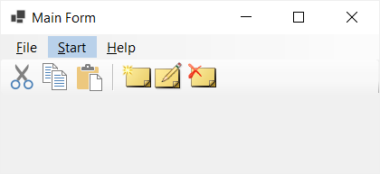

# Toolbar Ribbon Sample

This repository hosts a <b>Windows Forms</b> sample app with a <b>ribbon
style user interface</b> based on the standard Windows Forms ToolStrip
control and an extended custom ToolStripMenuItem (RibbonTabMenuItem) control.

The custom RibbonTabMenuItem control is used to display ribbon headers 
on a standard MenuStrip. It is based on the MenuItem control, extended 
by a toggle funtion. The selected RibbonTabMenuItem is highlighted and 
only one RibbonTabMenuItem can be selected at a time within a defined
toggle group.

The ribbon bars are implemented with larger size standard ToolStrip controls
and e.g., ToolStripButtons.

## Screenshot

## Usage

- Copy the RibbonTabMenuItem.cs class containing the custom RibbonTabMenuItem
control to your project. After compiling the custom control is avaiable in the
Windows Forms Designer and can be added to a MenuStrip.
- Add a MenuStrip to your Form and add ribbon headers as required using the
custom RibbonTabMenuItem.
- For every ribbon header add the corresponding ribbon bar using the ToolStrip
control. Adapt the tool strip according to your needs, e.g., increase the
ImageScalingSize to 32 pixels to have larger icons, increase left and right
Padding to 6 pixels in order to have the headers aligned with the buttons.
- Visibility of the ribbon bars (ToolStrips) can be managed via the
CheckStateChanged event of the RibbonTabMenuItem controls.
 
## Requirements

This WinForms App has the following system requirements:
- Windows 10, version 1809 (build 17763) or later.
- [Visual Studio 2022](https://visualstudio.microsoft.com/downloads/) with the following workloads and components:
    - .NET Desktop Development
- Building the .NET app also requires:
    - .NET 6 SDK version
